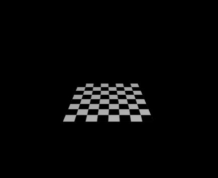
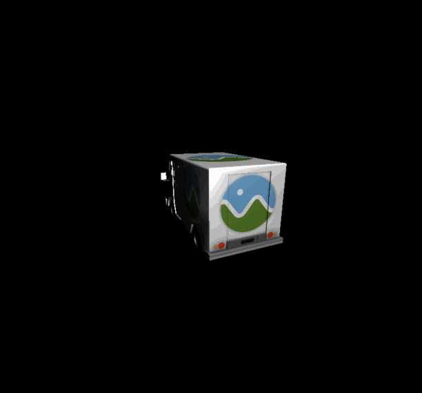
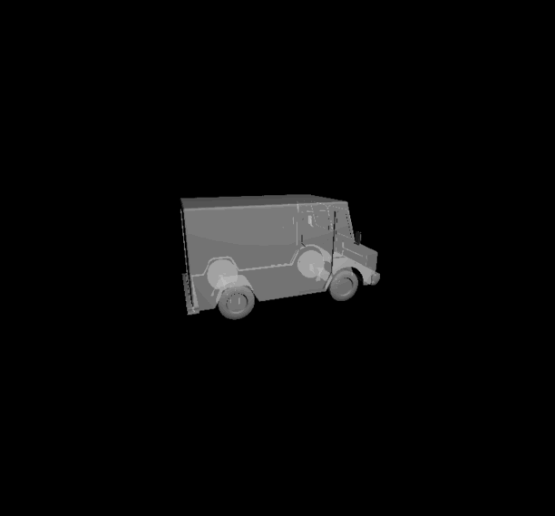
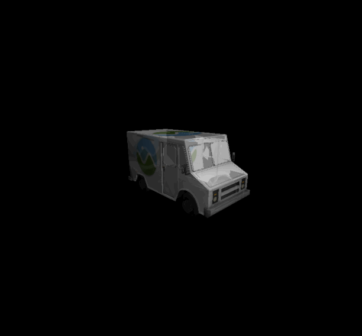
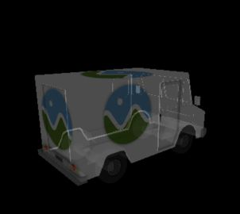

CUDA Rasterizer

===============
**University of Pennsylvania, CIS 565: GPU Programming and Architecture, Project 4**

* Jiawei Wang
* Tested on: Windows 10, i7-6700 @ 2.60GHz 16.0GB, GTX 970M 3072MB (Personal)
## Overview
___
* Implemented a simplified **rasterized graphics pipeline**, similar to the OpenGL pipeline using CUDA.   

| **Duck Wireframe/Points Toggle** | **CesiumMilkTruck K-Buffer**|
|---|---|
|||
* Basic Pipeline:
  * Vertex shading
  * Primitive assembly with support for triangles read from buffers of index and vertex data
  * Rasterization
  * Fragment shading
  * A depth buffer for storing and depth testing fragments
  * Fragment-to-depth-buffer writing (with atomics for race avoidance)
  * (Fragment shader) simple lighting scheme, such as Lambert or Blinn-Phong
* Additional Features:
  * BackFace Culling(optimized using stream compaction)
  * UV texture mapping with bilinear texture filtering and perspective correct texture coordinates
  * Support for rasterizing additional primitives:
    * Wireframes
    * Points
    * For rasterizing lines and points, you may start with a toggle mode that switches your pipeline from displaying triangles to displaying a wireframe or a point cloud
  * **Order-independent translucency using a k-buffer**

## Features Detail
___
### Perspective Correct Texture Coordinates
* Simply interpolate the 2D-coordinates on screen space will cause an unrealistic effect like the left image during the render. Because z-coordinates cannot be taken into account in simple screen space interpolation. 
* Perspective correct mapping interpolates after dividing by depth, then uses its interpolated reciprocal to recover the correct coordinate will fixed this problem.    

| **Without Perspective Correct Texutre** | **With Perspective Correct Texutre**|
|---|---|
||

### Wireframes and Points
* In this project, I still keep only one type of *Primitive Assembly* --- 'Triangle', but I created 2 other rasterizers for lines and points.  

| **cow.gltf** | **CesiumMilkTruck.gltf** |
|---|---|
|||

### Order-independent translucency using a k-buffer

* Commonly, 3D geometry with transparency is rendered by blending (using alpha compositing) all surfaces into a single buffer (think of this as a canvas). Each surface occludes existing color and adds some of its own color depending on its alpha value, a ratio of light transmittance. The order in which surfaces are blended affects the total occlusion or visibility of each surface. For a correct result, surfaces must be blended from farthest to nearest or nearest to farthest, depending on the alpha compositing operation, over or under. Ordering may be achieved by rendering the geometry in sorted order, for example sorting triangles by depth, but can take a significant amount of time, not always produce a solution (in the case of intersecting or circularly overlapping geometry) and the implementation is complex. Instead, **order-independent transparency** sorts geometry per-pixel, after rasterisation. For exact results this requires storing all fragments before sorting and compositing. [From https://en.wikipedia.org/wiki/Order-independent_transparency]
* In this project, I created a **K-buffer** for each fragmentbuffer. Each **K-buffer** contains 4 layers, each layer contains 4 channels, **RGBZ**.
* During the rasterization, instead of assigning a color to the fragmentbuffer, I assign the color to the K-buffer, and then sort it according to the depth(Z).
* Finally, we can do the correct alpha blend easily using the sorted K-buffer.  

| **K-Buffer Off** | **K-buffer On**|
|---|---|
| | |

| **Without Texture** | **With Texture**|
|---|---|
| | |

### Backface Culling
* In most cases, back faces are meaningless during the render, also it will increase the rendering time or even create some wrong visual effects. 
* We can easily use the `face_normal` and `eyePos` to determine whether a face is a 'backface', and then use the `thrust::romove` to do the *Stream Compaction*  

| **Backface Culling Off** | **Backface Culling On**|
|---|---|
| ||

| **Backface Culling Off** | **Backface Culling On**|
|---|---|
| ||
* You can see that without backface culling, there can be some artifacts during the transparency rendering.

### Performance Analysis
___
* There are 5 toggles as following:
  * Perspective_Correct_Toggle
  * BackFaceCulling_Toggle 
  * K_Buffer_Toggle 
  * Bilinear_Color_Filter_Toggle 
  * Naive_Sort_Toggle: a naive sort function for K-Buffer written by myself. If it's off, the project will use thrust::sort instead.
  
| **CesiumMilkTruck.gltf  Camera.z = -15.0 ** |
|---|
||
||

* BackFaceCulling: According to the form and plot, we can find that the backface culling reduce the FPS of the renderer. After backface culling, we do reduce the number of the faces to render, but we still spend many time on backface determining and stream compaction. 
* Bilinear_Color_Filter_Texture: According to the results, we can find out that only turn on the *Bilinear_Color_Filter* doesn't affect too much on the efficiency.
* Perspective_Correct: We can see that the FPS drop down from 180 to 84 when the *Perspective Correct* turns on. It's because each pixel during the rasterization has to call the `correct` function, which has lots of floating number calculations and divisions.
* K_Buffer: The FPS drop down to 10 ~ 12 when we turn on the *K_Buffer*. Compare with the K-Buffer-off situation, we have to some additional operations as following:
  * Comparing and Writting to dev_K_buffers during the rasterization
  * Writting to K-Buffers of the fragmentbuffer during the rasterization.
  * Sorting the K-Buffers according to their depth values during the rasterization.
  * Computing the Alpha Blending results during the render.
* Naive_Sort: I just use a naive *insertion Sort* method to replace the `thrust::sort_by_keys` and the FPS increases a lot. This is amazing but also confusing. I don't know how exactly the `thrust::sort_by_keys` works, but it should be similar to *Radix Sort* we implemented before. And in this case, the K-buffer only has 4 elements, so the *insertion Sort* will be definitely faster than *Radix Sort*, especially the sequence is sorted before the insertion. But the *Radix Sort* should not be such slow.

### Credits

* [Bilinear Filter](https://en.wikipedia.org/wiki/Bilinear_filtering) by WIKI
* [Order-independent-transparency](https://en.wikipedia.org/wiki/Order-independent_transparency) by WIKI
* [K-buffer](http://on-demand.gputechconf.com/gtc/2014/presentations/S4385-order-independent-transparency-opengl.pdf) by NVIDIA
* [tinygltfloader](https://github.com/syoyo/tinygltfloader) by [@soyoyo](https://github.com/syoyo)
* [glTF Sample Models](https://github.com/KhronosGroup/glTF/blob/master/sampleModels/README.md)
